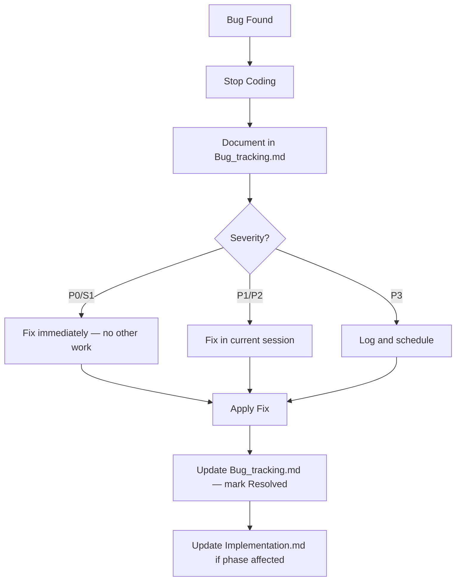

# Bug Tracking

> **WasteViz TPS Dashboard** — Bug Reporting, Triage & Resolution Guide
> Per `workflow.md`: **Stop coding → Document → Fix → Update this file.**

---

## Bug Reporting Process

When a bug is encountered during development, adhere to the following protocol (from `workflow.md`):

1. **STOP** writing new code immediately.
2. **IDENTIFY** the error type (build error, runtime error, linter warning, SSR mismatch).
3. **DOCUMENT** the bug in this file using the template below.
4. **APPLY** the fix.
5. **UPDATE** this file with the resolution and close the bug.

---

## Bug Priority Levels

| Priority | Label       | Definition                                         | SLA (solo dev)    |
| -------- | ----------- | -------------------------------------------------- | ----------------- |
| **P0**   | 🔴 CRITICAL | App won't start or database is at risk (data loss) | Fix immediately   |
| **P1**   | 🟠 HIGH     | Core feature broken (map won't render, API down)   | Fix today         |
| **P2**   | 🟡 MEDIUM   | Feature degraded, workaround exists                | Fix this sprint   |
| **P3**   | 🟢 LOW      | UI glitch, minor UX issue, typo                    | Fix when possible |

---

## Bug Severity Levels

| Severity          | Definition                                             |
| ----------------- | ------------------------------------------------------ |
| **S1 — Blocker**  | No workaround. CI/CD blocked. Data integrity at risk.  |
| **S2 — Critical** | Core user journey broken. No workaround.               |
| **S3 — Major**    | Feature partially broken. Workaround is painful.       |
| **S4 — Minor**    | Small edge case or cosmetic issue. Workaround is easy. |

---

## Bug Template

Copy and paste this template when logging a new bug:

```markdown
### BUG-XXX: [Short Title]

| Field          | Value                                   |
| -------------- | --------------------------------------- |
| **Date Found** | YYYY-MM-DD                              |
| **Found In**   | `apps/web` / `apps/api` / `packages/ui` |
| **Priority**   | P0 / P1 / P2 / P3                       |
| **Severity**   | S1 / S2 / S3 / S4                       |
| **Status**     | 🔴 Open / 🟡 In Progress / ✅ Resolved  |
| **Fixed In**   | [commit hash or date]                   |

**Error Message / Description:**

> Paste the full error message, linter warning, or description here.

**Reproduction Steps:**

1. Step one
2. Step two
3. ...

**Root Cause:**

> Explain WHY the bug occurred.

**Fix Applied:**

> Describe what was changed to fix it.

**Files Changed:**

- `path/to/file.ts`
```

---

## Bug Assignment & Workflow



---

## Known Bug Categories for This Stack

### SSR / Hydration Mismatches (Next.js 15)

- **Cause:** Using `mapcn` or any browser API (window, document) outside a `"use client"` component.
- **Prevention:** All `mapcn` components MUST have `"use client"` at the top.
- **Fix pattern:** Wrap map components in dynamic import with `ssr: false` if hydration issues persist:
  ```tsx
  const TpsMap = dynamic(() => import("@/components/map/TpsMap"), {
    ssr: false,
  });
  ```

### Database Connection Errors (Neon)

- **Cause:** `DATABASE_URL` not set or malformed in `.env.local`.
- **Prevention:** Fallback shield in `src/db/index.ts` prevents crash. Test with `test-connection.ts` before push.
- **Fix:** Verify `.env.local` at workspace root contains a valid Neon connection string.

### Soft-Delete Leakage

- **Cause:** Querying `bali_waste_drop_offs` without filtering `deletedAt IS NULL`.
- **Prevention:** All queries MUST go through `DropOffRepository.findAll()` — never query directly from routes.
- **Severity:** P0/S1 — data integrity issue.

### Tailwind Classes Not Applied

- **Cause:** Tailwind not correctly configured, or `globals.css` missing `@tailwind` directives.
- **Prevention:** Install Tailwind before Shadcn. Run `shadcn init` only after Tailwind is verified working.

### Map Coordinate Reversal

- **Cause:** Using `[Lat, Lng]` order (Google Maps style) instead of `[Lng, Lat]` (MapLibre/mapcn style).
- **Denpasar coordinates:** `[115.2167, -8.6500]` ← Correct (Lng first!)
- **Severity:** P1/S3 — map centers on wrong location.

---

## Active Bug Log

| ID      | Title                                         | Priority | Severity | Status      | Date       |
| ------- | --------------------------------------------- | -------- | -------- | ----------- | ---------- |
| BUG-001 | Shadcn init fails with unknown option --style | P2       | S4       | ✅ Resolved | 2026-03-05 |
| BUG-002 | Map component border misalignment             | P3       | S4       | ✅ Resolved | 2026-03-05 |
| BUG-003 | Type safety error in cluster click handler    | P1       | S1       | ✅ Resolved | 2026-03-05 |
| BUG-004 | MapLibre crashes on devices without WebGL     | P1       | S2       | ✅ Resolved | 2026-03-09 |

### BUG-001: Shadcn init fails with unknown option --style

| Field          | Value       |
| -------------- | ----------- |
| **Date Found** | 2026-03-05  |
| **Found In**   | `apps/web`  |
| **Priority**   | P2          |
| **Severity**   | S4          |
| **Status**     | ✅ Resolved |
| **Fixed In**   | 2026-03-05  |

**Error Message / Description:**

> error: unknown option '--style' during `bunx shadcn@latest init`
> ✖ Validating import alias. No import alias found in your tsconfig.json file.

**Reproduction Steps:**

1. Run `bunx shadcn@latest init --defaults --base-color slate --css-variables --style default -y` in apps/web
2. Run again without `--style` but with missing alias.

**Root Cause:**

> The newest version of the `shadcn` CLI likely deprecated or removed the `--style` flag. Also, Next.js 15 template without `src` directory needed `baseUrl` and `paths` defined in `tsconfig.json`.

**Fix Applied:**

> Bypassed the `--style` flag by using `-d` flag. Added `paths: { "@/*": ["./*"] }` to `apps/web/tsconfig.json`.

**Files Changed:**

- `apps/web/tsconfig.json`

---

### BUG-002: Map component border misalignment

| Field          | Value                                       |
| -------------- | ------------------------------------------- |
| **Date Found** | 2026-03-05                                  |
| **Found In**   | `apps/web/components/InteractiveTpsMap.tsx` |
| **Priority**   | P3                                          |
| **Severity**   | S4                                          |
| **Status**     | ✅ Resolved                                 |
| **Fixed In**   | 2026-03-05                                  |

**Error Message / Description:**

> Visual misalignment between the `InteractiveTpsMap` border-radius and its parent container in `page.tsx`. Multiple borders and shadows created a "dirty" look.

**Reproduction Steps:**

1. Review `InteractiveTpsMap.tsx` and `page.tsx`.
2. Observe double borders and mismatched `rounded-xl` / `rounded-2xl` classes.

**Root Cause:**

> Defensive styling inside the component duplicated styling already present in the layout container.

**Fix Applied:**

> Removed `border`, `shadow`, and fixed `rounded` from the inner component. Set height to `h-full` to allow parent container to drive the layout.

**Files Changed:**

- `apps/web/components/InteractiveTpsMap.tsx`

---

### BUG-003: Type safety error in cluster click handler

| Field          | Value                            |
| -------------- | -------------------------------- |
| **Date Found** | 2026-03-05                       |
| **Found In**   | `apps/web/components/ui/map.tsx` |
| **Priority**   | P1                               |
| **Severity**   | S1                               |
| **Status**     | ✅ Resolved                      |
| **Fixed In**   | 2026-03-05                       |

**Error Message / Description:**

> error TS18048: 'feature' is possibly 'undefined' in `map.tsx:1383`. Build fails.

**Reproduction Steps:**

1. Run `bun run build` or `bun tsc --noEmit`.

**Root Cause:**

> Accessing `features[0]` without a null check in the cluster click handler's logic.

**Fix Applied:**

> Added defensive `if (!feature) return;` checks before accessing properties and geometry.

**Files Changed:**

- `apps/web/components/ui/map.tsx`

---

### BUG-004: MapLibre crashes on devices without WebGL

| Field          | Value                                       |
| -------------- | ------------------------------------------- |
| **Date Found** | 2026-03-09                                  |
| **Found In**   | `apps/web/components/InteractiveTpsMap.tsx` |
| **Priority**   | P1                                          |
| **Severity**   | S2                                          |
| **Status**     | ✅ Resolved                                 |
| **Fixed In**   | 2026-03-09                                  |

**Error Message / Description:**

> `Could not create a WebGL context... Failed to initialize WebGL`
> The deployed Next.js application throws an uncaught exception and presents a white "Application error" full-page crash when accessed on a device or browser with Hardware Acceleration disabled.

**Reproduction Steps:**

1. Open Chrome Settings -> System.
2. Toggle "Use graphics acceleration when available" to OFF and relaunch.
3. Load the WasteViz dashboard.
4. Observe the unhandled React exception.

**Root Cause:**

> The MapLibre GL JS engine requires a valid WebGL context to render vector/3D tiles. Without it, the map instantiation throws a fatal error that bubbles up and crashes the React component tree.

**Fix Applied:**

> Added native canvas detection (`getContext('webgl')`) wrapped in a `useEffect` on mount. If WebGL is not supported, `InteractiveTpsMap.tsx` skips rendering the `<Map>` component entirely and instead gracefully displays a static fallback `div` prompting the user to enable hardware acceleration.

**Files Changed:**

- `apps/web/components/InteractiveTpsMap.tsx`

## Resolved Bug Log

> _Resolved bugs are archived here for future reference._

| ID  | Title | Priority | Resolution | Date Resolved |
| --- | ----- | -------- | ---------- | ------------- |
| —   | —     | —        | —          | —             |

---

_Last Updated: 2026-03-09_
